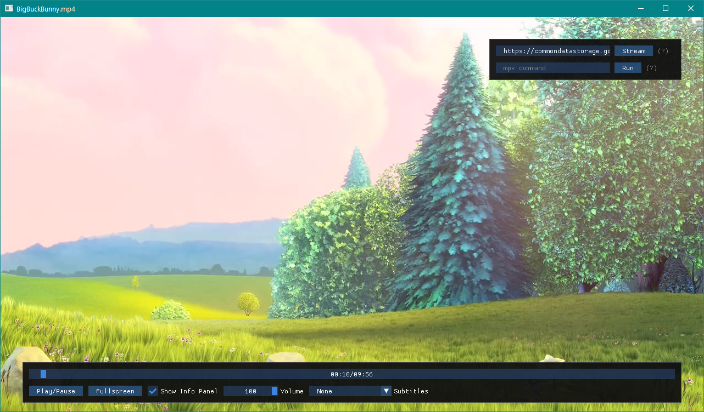

# Build

## Windows
- Install [msys2](https://www.msys2.org/)
- Launch MSYS2 MinGW 64-bit
- Install dependencies:
    ```
    pacman -S mingw-w64-x86_64-cmake mingw-w64-x86_64-SDL2 mingw-w64-x86_64-glew mingw-w64-x86_64-mpv 
    ```
- Update imgui submodule with `git submodule update`
- Optionally download [youtube-dl](https://youtube-dl.org/) and place the exe in the root directory of the project
- Run `./build-msys2.sh`

# Screenshot

